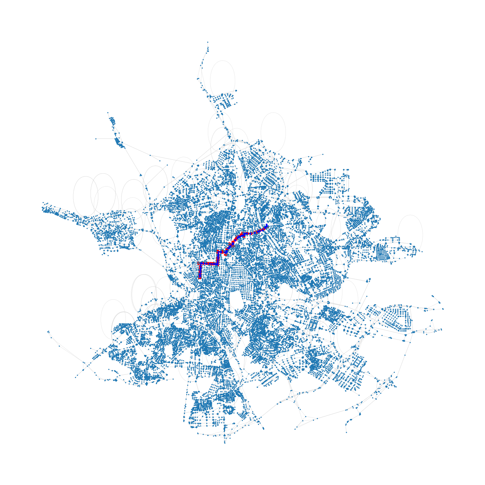
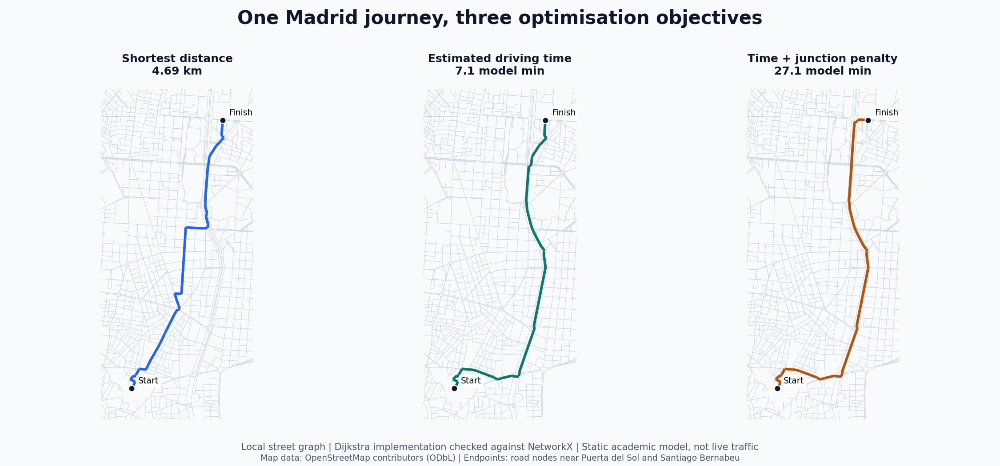
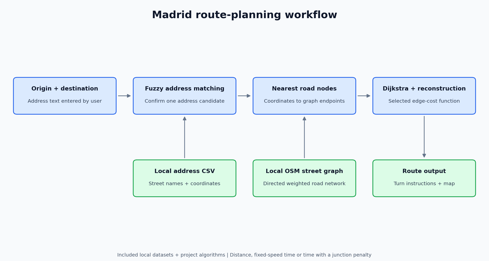

# Madrid Route Planner with Graph Algorithms


**Turn a Madrid address into a graph node, compute a route with Dijkstra and explain the journey with turn instructions and a map.**

Academic project by **Miguel Pajuelo Gómez and Jorge Ois de Pascual** for *Matemática Discreta*, ICAI, Universidad Pontificia Comillas. The main project is a Madrid route planner; two independent companion practices explore modular arithmetic, IMatLab and educational RSA.

[Usage example](#a-complete-usage-example) · [Route preview](#route-preview) · [Architecture](#how-the-route-planner-works) · [Run the GPS](#run-the-gps) · [Companion practices](#companion-practices) · [Validation](#validation-and-known-limits)

## A complete usage example

The practical goal is to help a user **select two addresses, choose a route criterion and read the resulting journey**.

This example ran the actual `gps.main()` application with local data. It selected **Calle de Alberto Aguilera, 23** as the origin and **Avenida de la Gran Via De Hortaleza, 1** as the destination, confirmed the address matches and chose the distance objective.

### Input and instructions

Excerpt from the actual terminal session (the application interface is in Spanish):

```text
Origen: Calle de Alberto Aguilera, 23
Has seleccionado: Calle de Alberto Aguilera, 23
Destino: Avenida de la Gran Via De Hortaleza, 1
Has seleccionado: Avenida de la Gran Via De Hortaleza, 1
Elige opción [1-3]: 1
Ruta mas rapida (metros) calculada. Nodos en el camino: 84
 1. Sigue 961 m por Calle de Blasco de Garay.
 2. Gira a la derecha hacia Calle de Cea Bermúdez.
 3. Sigue 585 m por Calle de Cea Bermúdez.
 4. Sigue recto y entra en Calle de José Abascal.
 5. Sigue 544 m por Calle de José Abascal.
 6. Gira a la izquierda hacia Calle de Alonso Cano.
```

[Full terminal session](.codex/visuals/usage_gps_session.txt), including candidate matches, all instructions and normal application exit.

### The application's route display



The blue nodes and grey edges are the included Madrid street graph; the red path is the application's selected route. The real plotting function generated this figure, with `plt.show()` replaced only by an image export so the example could run without opening a window. This checks the recorded application path, not every address or route, and does not certify the interactive GUI.

The address candidates require user confirmation. A query can match a different street when the requested address is absent from the included table; inspect the candidates rather than assuming the first result is the intended destination.

## Route preview



*Generated from the included street graph using this project's `camino_minimo` implementation. Endpoints are road nodes nearest to approximate coordinates for Puerta del Sol and Santiago Bernabéu. All three route costs were checked against NetworkX. Time estimates use a static academic model, not live traffic or measured journey times.*

[Route nodes, objective costs and generation details](.codex/visuals/madrid_routes.json). Map data: [© OpenStreetMap contributors](https://www.openstreetmap.org/copyright), [ODbL](https://opendatacommons.org/licenses/odbl/1-0/).

## What the project demonstrates

- **Algorithm implementation:** Dijkstra with a priority queue, path reconstruction, Prim and Kruskal in the weighted-graph module.
- **Geospatial processing:** loading street addresses, matching user input and mapping coordinates onto a local road graph.
- **Multi-objective route selection:** minimising distance, estimated driving time or time with an expected junction penalty.
- **Application logic:** interactive address selection, route instructions and Matplotlib visualisation.
- **Mathematical foundations:** separate coursework on modular operations, RSA and the limitations of educational cryptography.

## How the route planner works



The included dataset contains **213,811 address records**; the stored road graph has **31,388 nodes and 61,742 edges**, as recorded in [VALIDACION.md](VALIDACION.md). These are dataset sizes, not performance claims. The normal load uses local files, so it does not need to download Madrid again.

### Route objectives

| Objective | Edge cost | Meaning |
|---|---|---|
| Distance | Road segment length in metres. | Shortest total road distance. |
| Time | Length divided by a speed limit or road-type fallback. | Estimated driving time using fixed speeds. |
| Time + junction penalty | Time cost + **24 seconds per edge**. | Coursework model: 0.8 probability × 30 seconds stopped. |

The junction model does not identify real traffic lights. Different objectives can select different routes; their optimisation costs use different units and should not be compared as a single score.

## Repository guide

| Block | Contents |
|---|---|
| [gps/](gps/) | Main route planner, addresses, street graph and exploration notebooks. |
| [gps/callejero.py](gps/callejero.py) | CSV loading, coordinate conversion, fuzzy matching and graph preparation. |
| [gps/grafo_pesado.py](gps/grafo_pesado.py) | Dijkstra, path reconstruction, Prim and Kruskal. |
| [gps/gps.py](gps/gps.py) | Route objectives, user interaction, instructions and map display. |
| [Modular arithmetic / IMatLab](complementarios/01_modular_imatlab/) | Independent first practice, examples, benchmarks and tests. |
| [RSA](complementarios/02_rsa/) | Independent second practice: educational cryptography and terminal applications. |
| [Documentation](documentacion/) | [GPS report](documentacion/memoria_gps.docx) and [IMatLab report](documentacion/memoria_modular_imatlab.pdf). |

The companion practices are **not dependencies of the GPS**. Each contains its own modular-arithmetic version. IMatLab is written in Python and does not require MathWorks MATLAB.

## Run the GPS

Python **3.12** was used for the local preparation checks. From the repository root in PowerShell:

```powershell
python -m venv .venv
.\.venv\Scripts\python.exe -m pip install -r requirements.txt
.\.venv\Scripts\python.exe gps/gps.py
```

On Linux/macOS, use `.venv/bin/python` for installation and execution.

1. Enter an origin and select the appropriate address match.
2. Enter a destination and confirm its address match.
3. Choose distance, time or time with the expected junction penalty.
4. Read the instructions and inspect the route window.

The static GraphML and CSV are included. See [gps/DATOS.md](gps/DATOS.md) for formats, attribution and data provenance limits. Street layout/speed values are historical; this application is an academic prototype, not a live navigation service.

## Companion practices

### Modular arithmetic and IMatLab

From `complementarios/01_modular_imatlab`, using Python:

```sh
python imatlab.py
python imatlab.py ejemplosComandos.txt salida_local.txt
```

Example commands include `primo(7)`, `factorizar(8)`, `mcd(12,18)` and `inv(3,7)`. The practice uses the standard library and includes its original benchmarks, notebook and test suite. `bezout_n`, `raiz_mod_p` and `ecuacion_cuadratica` are incomplete; some expected example outputs therefore cannot be reproduced. [Practice guide](complementarios/01_modular_imatlab/README.md).

### Educational RSA

From `complementarios/02_rsa`:

```sh
python registrarusuario.py
python criptochat.py usuario1 usuario2
```

Register two test users before opening the terminal application. This interface encrypts/decrypts locally; it does not send network messages. The practice includes key generation, decimal padding, string encryption and educational attacks. Original users' keys/messages are excluded. `python prueba.py` uses the provided `X.txt` exercise and writes an ignored local `X_descifrado.txt`. [Practice guide](complementarios/02_rsa/README.md).

## Validation and known limits

| Component | Checked locally | Remaining scope |
|---|---|---|
| GPS | Three original objective costs matched NetworkX on local data; nearest-node lookup and instructions ran. The README preview adds three checked routes. | All possible routes, speed realism and the interactive GUI are not certified. |
| Graph algorithms | Dijkstra, Prim and Kruskal checked on a small graph; disconnected destinations and mixed-type node ties covered. | These cases are not a proof for every possible input. |
| IMatLab/modular suite | **74 passed, 11 failed** in the selected submission version. | Three incomplete functions remain explicitly documented. |
| RSA suite | **58 passed, 0 failed** in the existing tests. | Decimal padding and `random` are educational, not production cryptography. |
| Four notebooks | Original cells retained; format checked and old outputs removed. | No complete fresh execution of each notebook. |

These suite counts come from the repository preparation checks, not newly executed tests during the README update. To rerun them, install `requirements-dev.txt` in the environment and run `python -m pytest tests` **separately from each practice's directory**, so their two `modular.py` files do not conflict.

**Further reading:** [full validation notes](VALIDACION.md) · [provenance and portability changes](PROCEDENCIA.md) · [map/data attribution](gps/DATOS.md). Original reports and companion documentation remain in Spanish.
